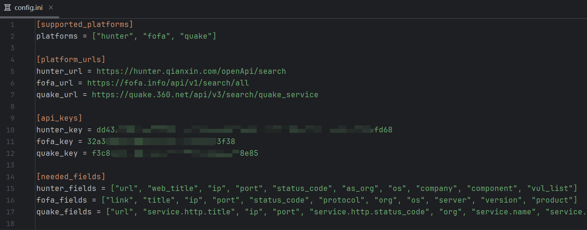

# 简介

调用“网络空间搜索引擎”的api接口，搜索出相应的资产信息，进而进行信息的获取、筛选，或敏感信息泄露的排查。


# 运行环境

- 使用Python 3.12开发。
- 代码中使用了海象符（:=），运行环境必须是Python 3.8以上。

- 运行建议：

```bash
# 创建虚拟环境
py -3.12 -m venv venv
# 激活虚拟环境
.\venv\Scripts\activate
# 安装依赖包（使用清华源）
pip install -r requirements.txt -i https://pypi.tuna.tsinghua.edu.cn/simple
```


# 使用说明

## 配置说明

- config/config.ini文件



- [platform_urls]：配置“空间测绘平台”API接口的URL
- [api_keys]：配置“空间测绘平台”的API KEY
- [needed_fields]：配置需要从搜索结果中获取的字段


## 简单使用

- 指定"单个平台"、“关键字”查询（多个关键字，用逗号、顿号隔开）

```bash
python assets_search.py hunter -k keyword1,keyword2
```

- 指定"单个平台"、“含有多个关键字的文件”查询（一行含有多个关键字，用逗号、空格、顿号隔开）

```bash
python assets_search.py fofa -kf keywords.txt
```

- 指定“多个平台”查询

```bash
python assets_search.py hunter,fofa -k keyword
```

- “所有平台”查询

```bash
python assets_search.py all -kf keywords.txt
```

- 指定响应结果的“status_code”查询

```bash
python assets_search.py quake -k keyword -sc "200"
```

- 指定“结果存放的文件”（仅支持：.csv .html ）

```bash
python assets_search.py hunter -k keyword -rf result.csv
```

- 指定“总页数”，“每页”大小

```bash
python assets_search.py fofa -k keyword -tp 2 -pz 10
```


# 参数说明

- 查看帮助

```bash
python assets_search.py -h
```

```bash
usage: assets_search.py [-h] [-k KEYWORDS | -kf KEYWORDS_FILE] [-rf RESULT_FILE] [-tp TOTAL_PAGES] [-pz PAGE_SIZE] [-sc STATUS_CODE] [-st START_TIME] [-et END_TIME] [-d DELAY]
                        platform

positional arguments:
  platform              support: hunter、fofa、quake、all

options:
  -h, --help            show this help message and exit
  -k KEYWORDS, --keywords KEYWORDS
                        keywords for search
  -kf KEYWORDS_FILE, --keywords_file KEYWORDS_FILE
                        like: keywords.csv
  -rf RESULT_FILE, --result_file RESULT_FILE
                        support: .csv .html
  -tp TOTAL_PAGES, --total_pages TOTAL_PAGES
                        default: 1
  -pz PAGE_SIZE, --page_size PAGE_SIZE
                        default: 10
  -sc STATUS_CODE, --status_code STATUS_CODE
                        format: "200"
  -st START_TIME, --start_time START_TIME
                        format: 2025-03-01
  -et END_TIME, --end_time END_TIME
                        format: 2025-03-30
  -d DELAY, --delay DELAY
                        default: 2.5

```


# 更新日志

##  v3.4.2  (2025.05.08)

- 优化“html”结果展示

##  v3.4.1  (2025.05.06)

- 优化“报错处理”

##  v3.4.0  (2025.05.06)

- 支持输出“.html”文件，可以“展开/折叠”

##  v3.3.3  (2025.05.04)

- 优化“status_code过滤”查询
- 优化“csv结果文件”保存

##  v3.3.2  (2025.04.20)

- 将“空间测绘平台”API接口的URL放到配置文件中
- 优化“分页查询”

##  v3.3.1  (2025.04.16)

- 优化“分页查询”，当前页查询结果为空时，剩余页不再查询

##  v3.3.0  (2025.04.15)

- 支持指定“查询的总页数”

##  v3.2.1  (2025.04.12)

- 优化“生成search_command”的方法

##  v3.2.0  (2025.04.11)

- 支持指定“多个平台”查询

##  v3.1.0  (2025.04.10)

- 优化“FOFA”获取“link”字段的方法
- 增加“FOFA”查询结果“status_code”过滤
- 优化“QUAKE”获取“url”字段的方法
- 增加“QUAKE”查询结果“status_code”过滤

##  v3.0.0  (2025.04.05)

- 支持“QUAKE”api接口查询
- 支持“all”参数，所有平台依次查询

##  v2.0.0  (2025.04.01)

- 支持“FOFA”api接口查询

##  v1.0.0  (2025.03.27)

- 给定“关键字”，调用hunter（鹰图）api接口，查询网络空间资产

